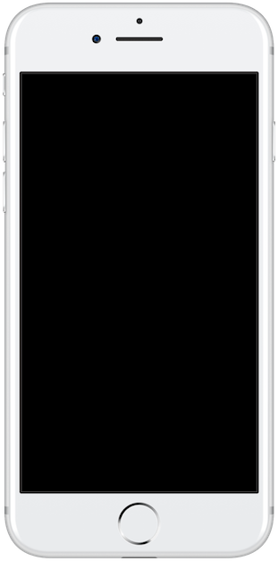
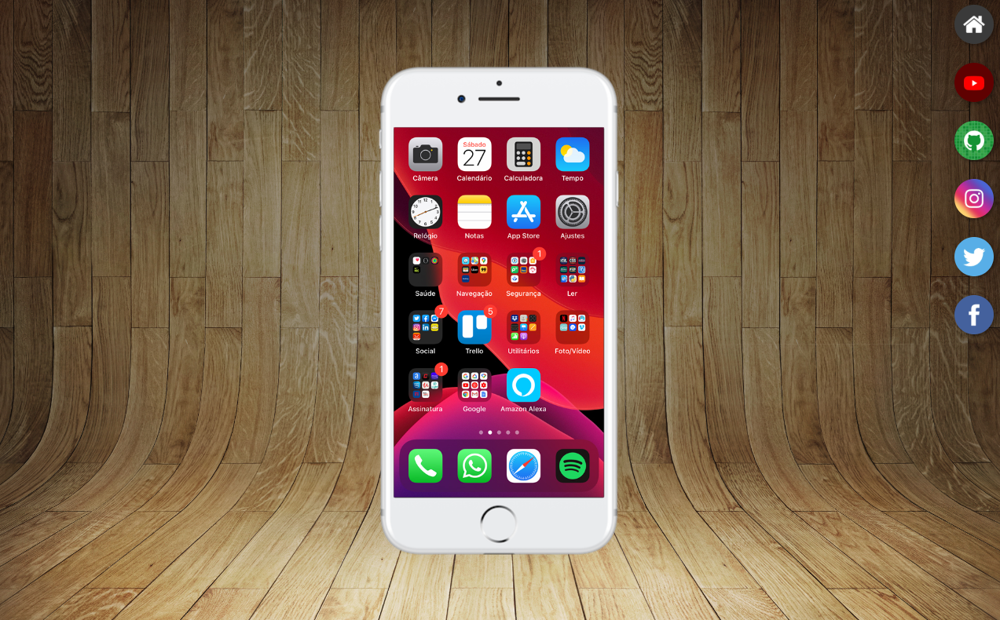

# 📱 Projeto Redes Sociais

<div align="center">



### 📲 Simulação de interface mobile com navegação entre redes sociais


</div>

---

## 🚀 Demonstração

🔗 **Live Preview:** https://anaclarissi.github.io/projeto-social/

💻 **Repositório:** https://github.com/anaClarissi/projeto-social

---

## 📷 Preview

<div align="center">



</div>

---

## 🧠 Sobre o projeto

Este projeto simula uma **interface de smartphone**, permitindo navegar entre diferentes redes sociais dentro de uma tela interativa.

A navegação acontece através de um **iframe**, onde cada rede social é exibida dinamicamente ao clicar nos ícones laterais.

O foco principal foi praticar:

* 🎨 Layout responsivo
* 🧩 Organização de páginas
* 🖼 Manipulação de conteúdo com iframe
* 💡 Experiência visual e UI

---

## ⚙️ Funcionalidades

* 📱 Simulação de tela de celular
* 🔗 Navegação entre páginas usando iframe
* 🎯 Interface interativa com ícones clicáveis
* 🌐 Acesso direto às redes sociais
* ✨ Efeitos visuais com hover

---

## 🛠 Tecnologias utilizadas

<div align="center">

| Tecnologia | Descrição                        |
| ---------- | -------------------------------- |
| HTML5      | Estrutura das páginas            |
| CSS3       | Estilização e layout             |
| Iframe     | Renderização de páginas internas |

</div>

---

## 🎮 Como usar

1. Acesse o projeto
2. Clique nos ícones das redes sociais
3. O conteúdo será exibido dentro do celular
4. Clique em **ACESSE** para abrir a rede social real

---

## 📂 Estrutura do projeto

```bash id="u3t7pd"
redes-sociais/
│
├── index.html
├── css/
│   ├── style.css
│   ├── social.css
│   ├── home.css
│   └── reset.css
├── pages/
│   ├── home.html
│   ├── youtube.html
│   ├── github.html
│   ├── instagram.html
│   ├── twitter.html
│   └── facebook.html
└── img/
    ├── frame-iphone.png
    ├── fundo-madeira.jpg
    ├── tela-*.jpg/png
    └── preview.png
```

---

## 🧩 Como funciona

* O layout principal simula um **dispositivo mobile**
* Cada botão lateral carrega uma página dentro do:

```html id="w7a2kn"
<iframe name="tela"></iframe>
```

* As páginas internas representam diferentes redes sociais
* Os links externos abrem em nova aba (`target="_blank"`)

---

## 🎨 Destaques do projeto

* 📱 Interface realista de smartphone
* 🎯 Navegação fluida e intuitiva
* ✨ Efeitos de hover com CSS
* 🧠 Organização modular de páginas

---

## 📦 Como rodar o projeto

```bash id="p9k2as"
# Clone o repositório
git clone https://github.com/anaClarissi/projeto-social.git

# Acesse a pasta
cd projeto-social

# Abra o index.html no navegador
```

---

## 🎓 Créditos

Projeto desenvolvido com base no curso de:

* 📺 Curso em Vídeo
* 👨‍🏫 Professor Gustavo Guanabara
* 🔗 https://www.youtube.com/@cursoemvideo
* 💻 https://github.com/cursoemvideo

---

## 👩‍💻 Autora

Feito com 💙 por **Ana Clarissi**

🔗 LinkedIn: https://www.linkedin.com/in/anaclarissi

---

## 📌 Aprendizados

Durante este projeto, foram praticados:

* Estruturação de múltiplas páginas
* Uso de iframe para navegação
* Estilização avançada com CSS
* Posicionamento absoluto
* Responsividade básica
* Criação de interfaces visuais realistas

---

## ✨ Melhorias futuras

* [ ] Adicionar mais redes sociais
* [ ] Melhorar responsividade para mobile
* [ ] Animações mais suaves
* [ ] Dark mode 🌙
* [ ] Versão interativa com JavaScript

---

## ⭐ Contribuição

Contribuições são bem-vindas!

1. Fork o projeto
2. Crie uma branch
3. Faça suas alterações
4. Envie um Pull Request

---

## 📄 Licença

Este projeto está sob a licença MIT.

---

<div align="center">

✨ Se gostou do projeto, deixe uma estrela! ✨

</div>